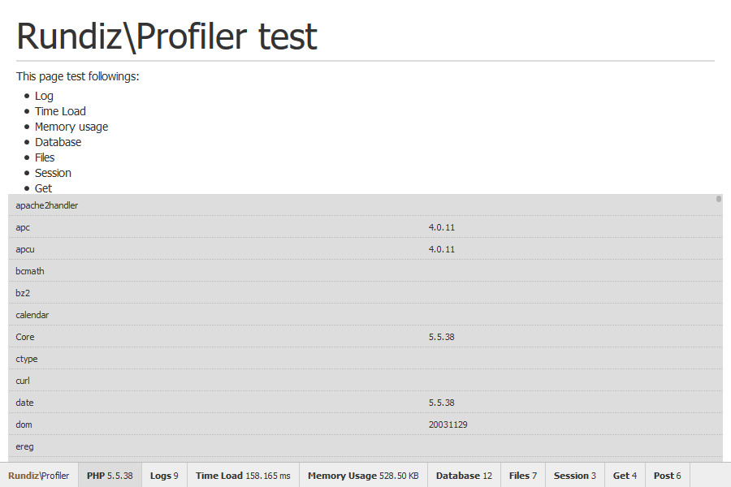

# Profiler Component

Record processes logs and display to the web browser. This can help you check your application performance such as time and memory usage. 
To see how it works, please look inside tests folder on [GitHub repository](https://github.com/Rundiz/profiler/tree/master/tests).

Now, it supported profiling the Database query, PHP sessions, GET, POST data via XHR or AJAX. See more how it works inside tests folder.

This profiler use [Particletree PHP Quick Profiler][1] ideas.

[1]: http://www.particletree.com/features/php-quick-profiler/